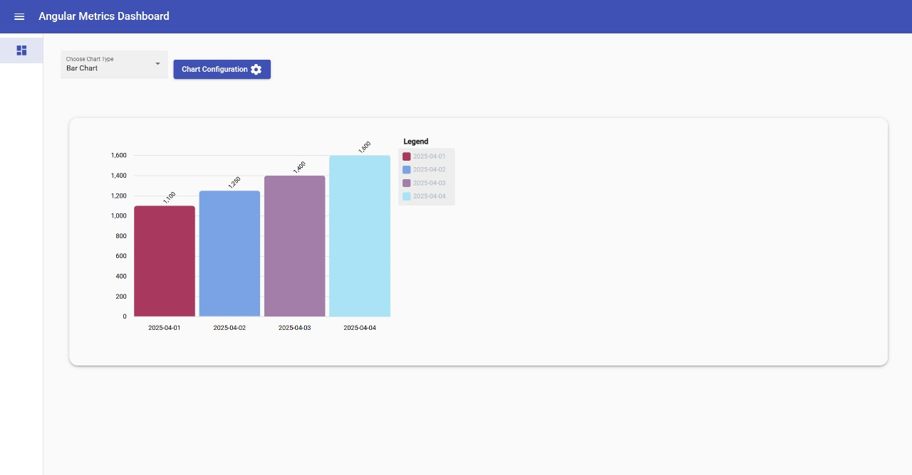
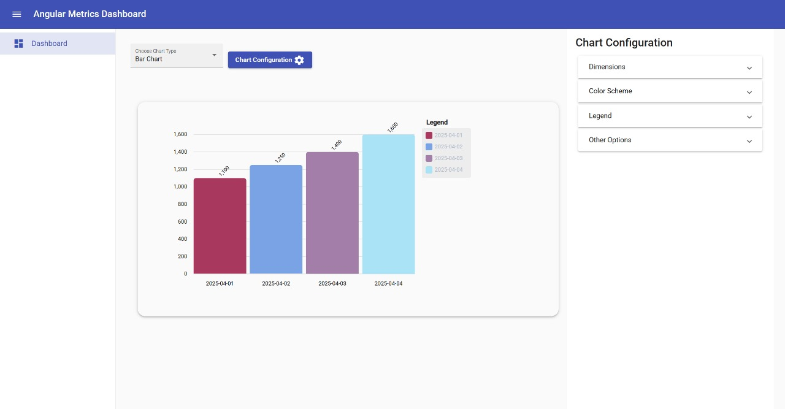
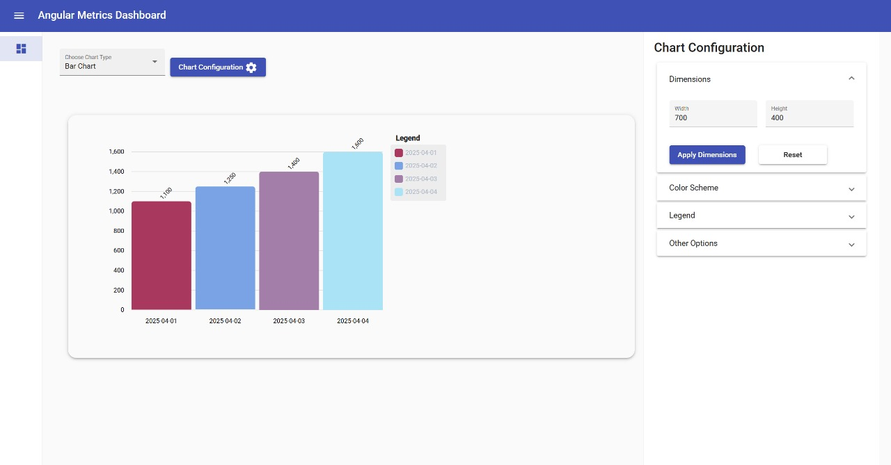
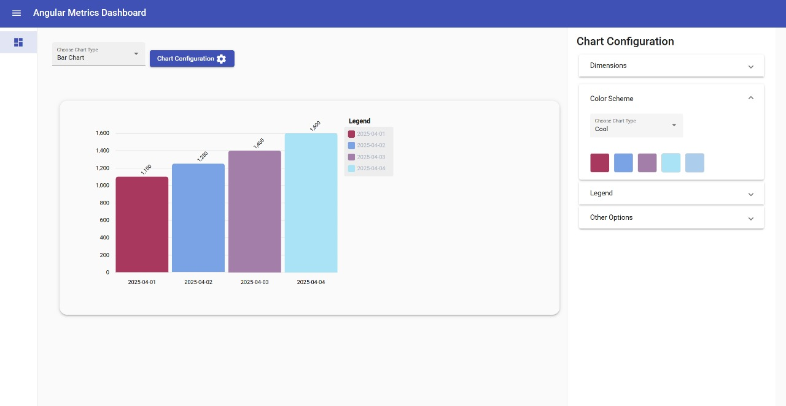
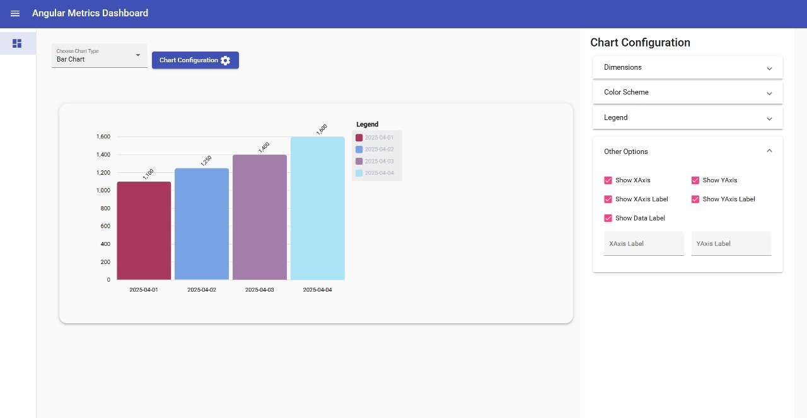

# Angular Metrics Dashboard

## 📊 Dynamic and Interactive Dashboard for Visualizing Metrics

## 🧩 Project Overview

**Angular Metrics Dashboard** is a dynamic analytics dashboard built using **Angular**, **Angular Material** and **ngx-charts**. 
It allows users to:

- Visualize mock metric data through dynamic graph components.
- Customize graphs in real time using a right-side sliding configuration panel.
- Use a left sidebar for navigation.
- Load components dynamically based on user-selected configurations (Chart selection dropdown).

This project is designed to demonstrate multiple graphs works well using ngx-charts (Bar Charts, Line Graphs, Pie Charts). Using configuration panel we can customize the charts & graphs.

---

## 🖼️ Screenshots
### 📌 Main Dashboard View

*This is the main dashboard showing various metrics visualized using dynamic graph components. Users can select or change Chart type using dropdown and graph view will load the graph according to user's selection.*

---

### 📌 Graph View with Chart Configuration Sliding Panel

*Users can open a right-side panel to customize each graph’s scale, colors, and appearance with real-time updates.*

---

### 📌 Graph View with Dimensions Configuration

*Users can adjust the graph's width and height, and also reset them if needed.*

---

### 📌 Graph View with Color Scheme Configuration

*Does user can change the theme of graphs?: Yes, Users can change the graph theme using the Color Scheme tab, which offers 5 pre-built themes with visible color palettes for easy selection.*

---

### 📌 Graph View with Legend Configuration

*Users can also configure the legend. To hide it, simply uncheck the legend checkbox.*

---

### 📌 Graph View with Other Configuration

*Users can also configure graph options like the X and Y axes, including their labels.*

---

## 🚀 How to Run the Project

### Install dependencies

```bash
npm install
```

### Json Server

Go to the `src/assets/mock-metrics.json` file and run the following command to start the JSON server:

```bash
json-server --watch src/assets/mock-metrics.json
```

### Run the development server

```bash
ng serve
```

Then open your browser and navigate to:
http://localhost:4200

---